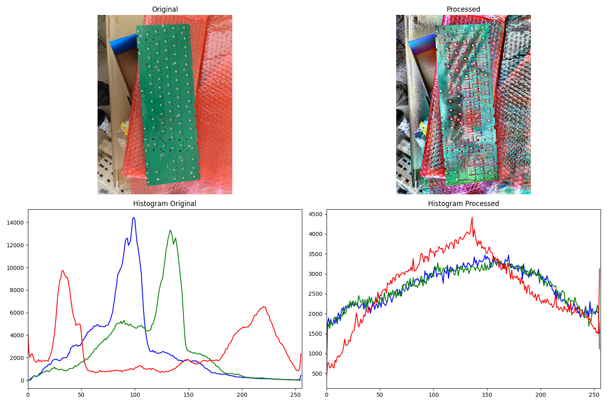

# Histogram Image Enhancer

A Python tool for digital forensics that enhances images using histogram equalization techniques. Works with JPG, PNG, and other common image formats.

## Features

- Histogram equalization for image enhancement
- CLI interface for easy usage
- Support for JPG, PNG, BMP, and TIFF formats
- Visual comparison of original vs enhanced images
- Batch processing capabilities

## Installation

```bash
pip install -e .
```

### Requirements
- Python 3.8+
- OpenCV (cv2)
- NumPy
- Matplotlib
- Pick (for interactive menu)

## Usage

```bash
histogram_enhancer image.jpg
```

This will launch an interactive menu where you can choose from the following enhancement methods:

   - Contrast Limited Adaptive Histogram Equalization (CLAHE)
   - Global Histogram Equalization
   - Gamma

## Examples

Before and after comparison:



## Contributing

Please see [CONTRIBUTING.md](docs/CONTRIBUTING.md) for guidelines on how to contribute to this project.

## License

This project is licensed under the MIT License - see the [LICENSE](LICENSE) file for details.